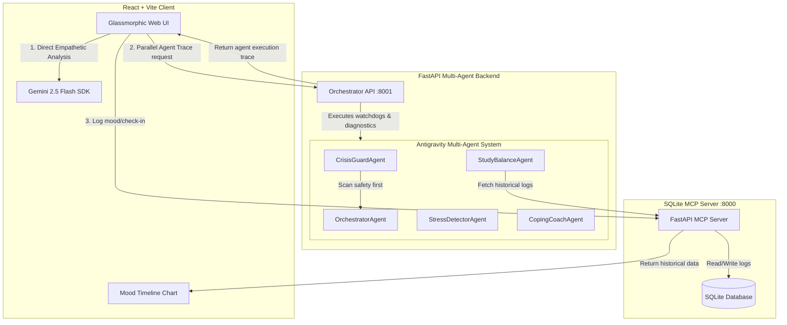

# MindMitra – AI‑Powered Wellness Companion for Indian Exam Aspirants 🎓✨

> **MindMitra** is a modern, glassmorphic web companion designed specifically for Indian exam aspirants (JEE, NEET, UPSC, CAT, etc.). It addresses the severe academic pressure, burnout, and isolation of competitive exams using an empathetic AI-driven journal, multi-agent diagnosis, real-time activity tracking, interactive mindfulness tools, and local data persistence via a Model Context Protocol (MCP) server.

---

## 📌 The Problem

Indian competitive exams like JEE, NEET, and UPSC are among the most stressful in the world, with millions of students competing for a tiny fraction of seats. Key challenges include:
- **Severe Academic Pressure**: Constant fear of failure and comparison anxiety.
- **Burnout**: Exhausting study schedules (12–14 hours/day) that lead to chronic fatigue.
- **Emotional Isolation**: Students feel unable to share their fears with parents or peers.
- **Lack of Immediate Coping Strategies**: Few actionable, culturally relevant ways to destress or self-regulate in high-stakes moments.

## 💡 The Solution

**MindMitra** acts as a virtual "mitra" (friend) to walk with students through their preparation:
1. **Vibe Check (AI Journal)**: An empathetic journaling space powered by Gemini 2.5 Flash. It translates thoughts into structured wellness diagnostics (stress triggers, emotional patterns, Hindi/Tamil sibling advice, and 10-minute actionable tasks).
2. **Multi-Agent Diagnostics**: An orchestration engine consisting of 5 specialized agents that verify safety, analyze burnout logs, evaluate stress levels, and generate customized coping strategies.
3. **Model Context Protocol (MCP) Integration**: Connects to a local SQLite-backed MCP server to log mood states, enabling persistent history, 7-day and 30-day timeline charts, and connection health states.
4. **Interactive Vent Wall**: A canvas-based particle simulation where students type their toxic thoughts and watch them dissolve into stardust.
5. **Mindfulness Studio**: Guided breathing (box breathing, muscle relaxation) to rapidly calm the nervous system before study sessions.

---

## 🏛️ Architecture & Data Flow

MindMitra utilizes a distributed, multi-agent design consisting of a React frontend, a FastAPI orchestrator backend, and a FastAPI SQLite MCP server.



### The 5 Specialized Agents:
1. **CrisisGuardAgent** 🛡️: Scans for crisis keywords first. If flagged, it immediately returns crisis safety hotlines and bypasses all other agents.
2. **OrchestratorAgent** 🧠: Coordinates specialist agents and aggregates trace payloads.
3. **StressDetectorAgent** 🔍: Classifies academic stress levels and flags hidden fatigue signals.
4. **StudyBalanceAgent** 📊: Reviews recent study hours from the MCP history to check for burnout risks.
5. **CopingCoachAgent** 💡: Recommends specific study-life boundary adjustment tactics.

---

## 🛠️ Tech Stack

| Layer | Technology |
|---|---|
| **Frontend Framework** | React 18 + Vite 4 |
| **Styling & Theming** | Vanilla CSS (with premium `stitch-` design tokens) |
| **AI Processing** | Google Gemini 2.5 Flash (Client-side translation & advice) |
| **Agentic SDK** | Google Antigravity SDK (Agent orchestration) |
| **Backend Framework** | FastAPI (Orchestrator & SQLite MCP API) |
| **Database** | SQLite3 (Persistent logging) |
| **Testing** | Vitest + Happy-DOM (Unit testing), Playwright (E2E testing) |

---

## 🚀 Getting Started & Setup

### 1. Clone & Install Dependencies
```bash
# Clone the repository
git clone https://github.com/MuskaanTimbadiya/MindMitra.git
cd MindMitra

# Install frontend dependencies
npm install
```

### 2. Configure Environment Variables
Create a `.env` file in the root folder (or copy from `.env.example`):
```bash
cp .env.example .env
```
Inside `.env`, add your Gemini API Key:
```env
VITE_GEMINI_API_KEY=your_gemini_api_key_here
VITE_MCP_URL=http://localhost:8000
VITE_ORCHESTRATOR_URL=http://localhost:8001
```

### 3. Run the Services (Docker Compose)
The easiest way to start both the Python agent backend and the SQLite MCP server is via Docker Compose:
```bash
docker-compose up --build
```
This launches:
- **MCP Server** on `http://localhost:8000`
- **Orchestrator API** on `http://localhost:8001`

### 4. Start the Frontend Dev Server
In a separate terminal tab, run the React client:
```bash
npm run dev
```
Open **`http://localhost:5173`** in your browser.

---

## 🧪 Testing

### Running Unit Tests (Vitest)
Unit tests cover headers, badges, languages, the Vent Wall particle canvas, and the Agent Activity Feed:
```bash
npm run test
```

### Running E2E Tests (Playwright)
Ensure the preview server is compiled and running:
```bash
# Build & start preview
npm run build
npm run preview

# In another terminal, run playwright tests
npm run test:e2e
```

---

## 🎨 Stitch Design Tokens
* **Primary Theme**: Deep cosmic purple (`#0e0b16`) and rich obsidian (`#1b1528`).
* **Accent Palette**: Glowing teal (`#4ab0a4`), warm sunset amber (`#d5897c`), and soft lavender (`#e0b0ff`).
* **Glass-morphism**: Translucent panels using `backdrop-filter: blur(12px)` and subtle white borders (`rgba(255,255,255,0.08)`).
